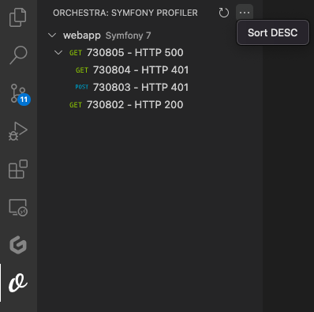

# Orchestra

Orchestra is a vscode extension supporting the development of Symfony Framework projects.

## Features

### Profiler viewer
If your project has Symfony `Profiler` installed, then VS Code will show you the created sessions and allow you to open them on the browser for inspection.

#### How it works?
For now, using the default `Symfony Profiler` path inside `var/cache/dev/profiler/index.csv`, Orchestra will present the list of created sessions. 

Some features:
- Colored HTTP verbs for better visibility
- Automatic refresh of any created profiles
- Child requests are collapsed inside parent requests for better inspection
- Clicking on the request will open the profiler route on your browser
